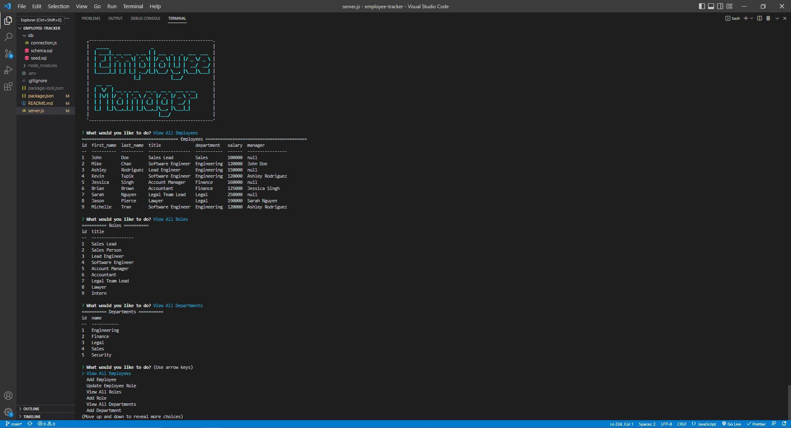

# Employee Tracker

## Description

Using Node.js, Inquirer, and MySQL, this command-line application was created to manage a company's employee database.

## Table of Contents

- [Installation](#installation)
- [Usage](#usage)
- [License](#license)
- [Contributions](#contributions)
- [Tests](#tests)
- [Questions](#questions)

## Installation

- clone repo into your local environment
- make sure to have Node.js and run 'npm i' to install necessary packages

## Usage

Instructions for use

- first, follow installation instructions then follow instructions bellow
- run 'npm start' to start application
- **please note that this application does come with seed data**

Github repo: https://github.com/michelletrn/employee-tracker
Demo video: https://drive.google.com/file/d/1s1qsKEej8w6BKTrB-GOEBSlC3L76EPzl/view

Here is a screen shot of a generated team profile page:

## License

MIT

## Contributions

Contributors: Michelle Tran

## Features

N/A

## Tests

N/A

## Questions

If you have any questions, please contact:

Github: Michelletrn, Email: tranmichelle997@gmail.com
